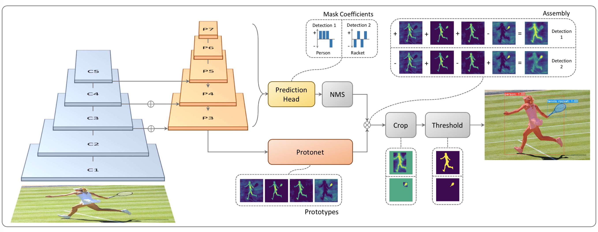
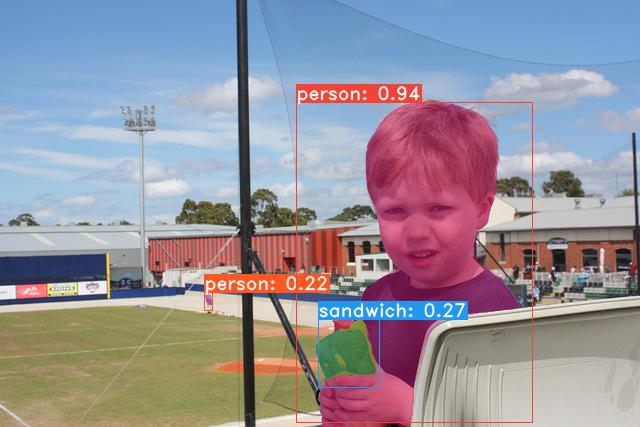
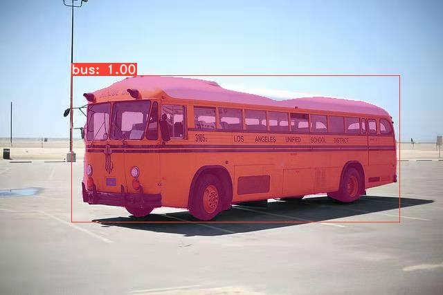
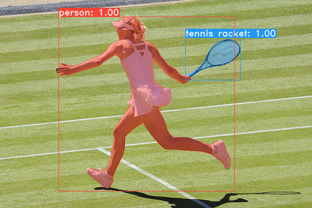
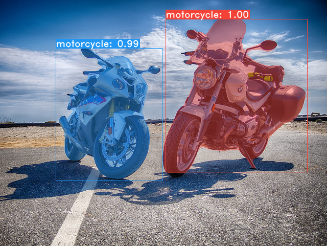

# **Y**ou **O**nly **L**ook **A**t **C**oefficien**T**s
This is the minimal Pytorch implementation of yolact. The full details are in the [paper](https://arxiv.org/abs/1904.02689). This repo enables you to have a quick understanding of yolact algorithmn.



## Installation
 - Set up a Python3 environment.
 - Install [Pytorch](http://pytorch.org/) 1.0.1 (or higher) and TorchVision.
 - Install some other packages:
 
 ```Shell
 $ pip install pillow opencv-python
 ```
 - Clone this repository and enter it.
 
 ```Shell
 $ git clone https://github.com/YunYang1994/pytorch-yolact.git
 ```
 
## Inferenece
Download pretrained [weights](https://github.com/YunYang1994/pytorch-yolact/releases/download/v1/yolact_darknet53_54_800000.pth) and test it 

```Shell
$ wget https://github.com/YunYang1994/pytorch-yolact/releases/download/v1/yolact_darknet53_54_800000.pth
$ python image_demo.py
```

|||
|---|---
||
 
 
